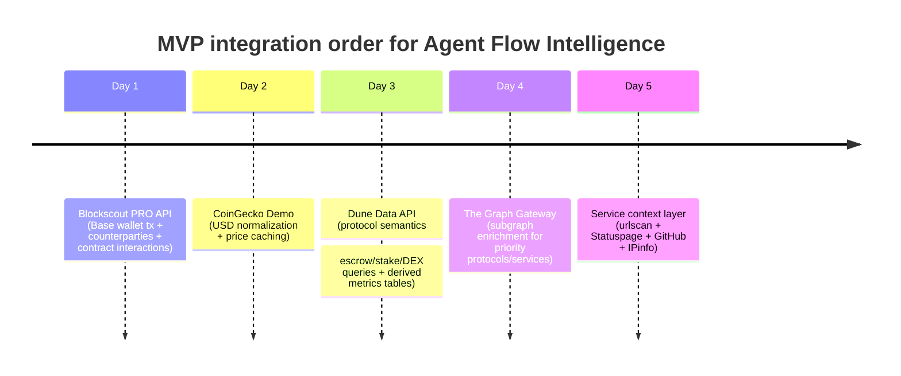
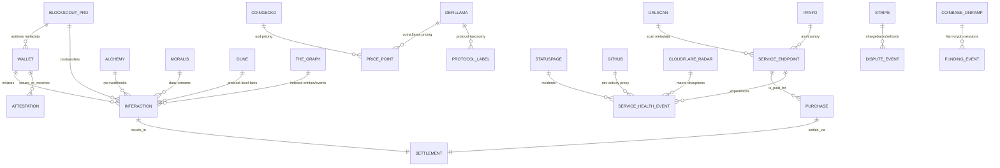

# Expanding Agent Flow Intelligence With Complementary Free or Freemium APIs

## Executive summary

Agent Flow Intelligence becomes markedly stronger when you combine three kinds of signals: low-level onchain activity (who paid whom, when, how often), protocol-level semantics (what *kind* of activity it was—swap, bridge, escrow completion, staking/slashing), and service-quality context (whether the “service endpoint” the agent paid for was reachable, reputable, or incident-prone). The fastest hackathon MVP path is to start with a “behavior first” graph centered on **Wallet ⇄ Interaction ⇄ Settlement ⇄ ServiceEndpoint**, then enrich and label it using independent APIs that are mostly free or freemium—especially explorer/indexer APIs, analytics query APIs, and public service-status / metadata feeds. citeturn14view0turn6view0turn15view1turn25view0turn19view1

The highest-leverage additions beyond your current spine (Locus/x402/Base+Etherscan/EAS/PEAC) are: **Blockscout PRO API** for multichain explorer-grade address/tx data with a generous free plan, **Dune Data API** and **The Graph** for protocol-level event semantics, **CoinGecko** and **Coins.llama.fi** for pricing normalization, and then **urlscan + Statuspage + GitHub + IPinfo + Cloudflare Radar** for service endpoint observability, risk flags, and uptime context. citeturn6view0turn6view2turn14view1turn17search0turn10search22turn25view0turn18search3turn18search13turn21search20turn20search9

---

## Priority list and comparison table

Signal abbreviations used below (mapped to your list): **WA** wallet age, **TX** tx count, **CP** counterparties, **APS** avg payment size, **RCP** repeat counterparty rate, **DIS** refunds/reversals/disputes, **ESC** escrow completion, **STK** stake vs slashed, **DDL** deadline miss rate, **USP** unique services purchased, **RAIL** volume through known rails, **FREQ** frequency consistency / burstiness, **CONC** concentration & funding dependency, **DORM** dormant→active, **CID** contract interaction diversity, **ATT** attestations issued/received, **SLAT** settlement latency, **FLAT** fulfillment latency.

| API (provider) | Base URL | Signals covered (high level) | Free tier / limits | Auth | Webhooks | Ingestion | Priority |
|---|---|---|---|---|---|---|---|
| Blockscout PRO API (Blockscout) | `https://api.blockscout.com/{chain_id}/api/v2/...` | WA, TX, CP, APS, RCP, FREQ, CONC, DORM, CID, SLAT | **Free plan: 100K API credits/day + 5 req/sec** citeturn6view0turn24search4 | API key (query or header) citeturn6view0 | No | Easy | **5** |
| CoinGecko Demo API (CoinGecko) | `https://api.coingecko.com/api/v3/...` | APS (USD), RAIL (USD), volatility normalization | **Free Demo: 30 calls/min; 10,000 calls/month** citeturn17search0turn17search7 | Demo key (header or query param) citeturn17search7turn17search13 | No | Easy | **5** |
| Dune Data API (Dune) | `https://api.dune.com/api/v1/...` | ESC, STK, CID, CP, APS, RAIL, FREQ (via queries) | Free plan rate limits: **15 rpm (low) / 40 rpm (high)** citeturn6view2 | `X-DUNE-API-KEY` citeturn15view1turn15view0 | Yes (supported) citeturn15view1 | Medium | **5** |
| The Graph Gateway / Subgraphs (The Graph) | `https://gateway.thegraph.com/api/<API_KEY>/subgraphs/id/<SUBGRAPH_ID>` | ESC, STK, CID, USP (protocol labeling), ATT (protocol-specific) | **100,000 free queries/month** per subgraph citeturn14view1 | API key (URL or bearer) citeturn14view2turn14view0 | No | Medium | **4** |
| DefiLlama Open APIs (DefiLlama / Llama) | `https://api.llama.fi/...` and `https://coins.llama.fi/...` | APS (pricing), USP (protocol categories), RAIL (chain metrics) | Open plan described as free access (limits unspecified) citeturn10search1turn11view1turn10search22 | None | No | Easy | **4** |
| Alchemy Node API (Alchemy) | `https://base-mainnet.g.alchemy.com/v2/<api-key>` | WA, TX, CP, CID, SLAT (+ optional webhooks) | Free tier: **30,000,000 CU/month; 500 CU/sec; 5 webhooks** citeturn23search8turn12search3 | API key in URL citeturn12search0turn12search11 | Yes (Notify address activity) citeturn4search0 | Medium | **4** |
| Moralis EVM Data API + Streams (Moralis) | `https://deep-index.moralis.io/api/v2.2/...` | WA, TX, CP, CID, SLAT, FREQ; Streams helps latency & delivery | Free plan: **40,000 CU/day; 1,000 CU/sec; 25 streams** citeturn4search1turn4search5 | `X-API-Key` citeturn28search3turn24search17 | Yes (Streams webhooks) citeturn28search6turn24search11 | Medium | **4** |
| urlscan.io API (urlscan.io) | `https://urlscan.io/api/v1/...` | Service endpoint risk flags, hosting metadata, redirect chains → DDL/FLAT risk | Quotas vary per action; exposes *per-minute/hour/day* headers; query quotas endpoint citeturn25view0 | API key header `API-Key` citeturn25view0 | No | Medium | **3** |
| Atlassian Statuspage API (Atlassian) | Manage API: `https://api.statuspage.io/v1/...` | Service uptime/incident context → DDL/FLAT risk, reliability bands | **1 req/sec per API token** citeturn18search0 | `Authorization: OAuth <key>` citeturn19view1 | No | Easy | **3** |
| GitHub REST API (GitHub) | `https://api.github.com/...` | Service quality proxies (release cadence, issue closure) → DDL/FLAT risk | **5,000 requests/hour** (authenticated) citeturn3search0turn18search13 | PAT / OAuth citeturn18search16turn3search32 | Yes (webhooks, optional) citeturn18search5 | Easy | **3** |
| IPinfo Lite API (IPinfo) | `https://api.ipinfo.io/lite/...` | Endpoint ASN/country concentration → CONC, risk flags | Lite: **free + unlimited requests** citeturn21search0turn21search24 | Token (query/header); Lite described as free-tier citeturn21search1turn21search20 | No | Easy | **3** |
| Cloudflare Radar API (Cloudflare) | `https://api.cloudflare.com/client/v4/radar/...` | Macro internet disruption / traffic context → DDL/FLAT risk | Radar API described as free; Cloudflare global API limit **1200 requests/5 min/user** citeturn21search31turn21search3 | Cloudflare API token citeturn20search9turn20search17 | No | Medium | **2** |
| Coinbase Onramp API (Coinbase CDP) | `https://api.cdp.coinbase.com/platform/v2/onramp/...` | Funding-wallet dependency, rail volume, fiat→crypto activity → RAIL/CONC | Limits vary by endpoint; Buy Quote throttling **10 rps** (per app id) citeturn22search36turn26view0 | Bearer token (JWT) citeturn26view0 | N/A | Hard | **2** |
| Stripe API (Stripe) | `https://api.stripe.com/v1/...` | DIS (refund/dispute), settlement & refund timelines | Test mode available (no banking network interaction) citeturn18search14turn18search2 | Bearer secret key | Webhooks yes (standard) | Hard | **2** |

---

## Detailed API notes with signal mapping, auth, examples, cadence, and MVP cost

Below, each API is mapped explicitly to your signal list, with **example queries** and **hackathon-friendly cadence**. When a detail is not stated in docs, it is marked **unspecified**.

### Blockscout PRO API

**Provider / docs**  
```text
https://docs.blockscout.com/devs/pro-api
https://docs.blockscout.com/devs/plans-and-credits
https://base.blockscout.com/api-docs
```
citeturn6view0turn24search4turn24search26

**Unique signals it adds (mapped):** WA (first-seen tx time), TX, CP, APS (native/token transfers), RCP, FREQ (inter-arrival times), bursty behavior (tx bursts), CONC (top counterparties; funding source), DORM, CID (distinct contract calls), SLAT (block inclusion time). It is especially useful because it is explorer-grade data without an Etherscan dependency, and offers universal PRO routes. citeturn6view0turn24search1

**Auth + free tier limits:** Free plan includes **100K API credits/day** and **5 requests/second**; requires a PRO API key (query param or `authorization` header). citeturn6view0turn24search4

**Example high-value calls**  
```bash
# REST: fetch a block (example route pattern via PRO API, chain_id=8453 for Base)
curl "https://api.blockscout.com/8453/api/v2/blocks/12345678?apikey=proapi_YOUR_KEY"

# JSON-RPC style via PRO routing (example shown in docs uses chain_id in path)
curl -H "content-type: application/json" \
  -H "authorization: Bearer proapi_YOUR_KEY" \
  -X POST --data '{"id":0,"jsonrpc":"2.0","method":"eth_blockNumber","params":[]}' \
  "https://api.blockscout.com/8453/json-rpc"
```
Routes and auth methods shown in Blockscout PRO documentation. citeturn6view0

**Ingestion complexity:** Easy. Simple REST/RPC calls; pagination supported on many endpoints. citeturn24search1

**Privacy / legal notes:** Onchain data is public; do not add “identity truth” overlays. If you later map wallets to identities, treat that as higher-risk (PII) enrichment.

**Polling cadence + hackathon MVP cost:** Poll wallet activity every 3–10 minutes for a small cohort (10–200 wallets), or do “pull on demand” per UI view. Cost should remain **$0** if under 100K credits/day. citeturn6view0turn24search4

**Priority score:** **5/5**. Strong coverage of core behavioral signals with a clear free plan and straightforward ingestion. citeturn6view0

---

### CoinGecko Demo API

**Provider / docs**  
```text
https://docs.coingecko.com/docs/setting-up-your-api-key
https://www.coingecko.com/en/api/pricing
```
citeturn17search7turn17search0

**Unique signals it adds (mapped):** APS (normalize amounts to USD), RAIL (volume-through-rail in USD), FREQ/volatility context (optional). While CoinGecko is “market data,” it directly powers your behavioral scoring by turning token amounts into comparable dollars. citeturn17search1turn17search7

**Auth + free tier limits:** Demo root URL is **`https://api.coingecko.com/api/v3/`**; Demo plan is **30 calls/min** with **10,000 calls/month**. Public plan rate limiting can vary (5–15 calls/min), so Demo is preferred for stable MVP behavior. citeturn17search7turn17search0turn17search5

**Example high-value calls**  
```bash
# Prices for a token contract on Base (example pattern; use Demo key)
curl "https://api.coingecko.com/api/v3/coins/markets?vs_currency=usd&ids=bitcoin&x_cg_demo_api_key=YOUR_KEY"
```
CoinGecko documents Demo key usage via query param and the Demo root URL. citeturn17search7turn17search13

**Ingestion complexity:** Easy.

**Privacy / legal notes:** Generally low PII; still follow CoinGecko API terms and key-handling guidance. citeturn17search2turn17search7

**Cadence + hackathon cost:** Poll prices every 1–5 minutes for volatile assets, or every 15 minutes for stablecoins; cache aggressively to stay within 10k calls/month. Expect **$0** for hackathon MVP if you batch and cache. citeturn17search0turn17search7

**Priority score:** **5/5**. Without normalized USD, “avg payment size” and “volume over time” are hard to compare across tokens and rails.

---

### Dune Data API

**Provider / docs**  
```text
https://docs.dune.com/api-reference/overview/getting-started
https://docs.dune.com/api-reference/overview/rate-limits
https://docs.dune.com/api-reference/overview/authentication
```
citeturn15view1turn6view2turn15view0

**Unique signals it adds (mapped):** ESC (escrow completion by reading protocol events), STK (stake posted vs slashed via protocol tables/events), CID (contract interaction diversity with categorization), USP (unique “services” by protocol taxonomy), CP/APS/RAIL via custom SQL. Dune is best when you already know which protocols/contracts matter and want consistent, queryable results. citeturn15view1turn15view2

**Auth + free tier limits:** Uses `X-DUNE-API-KEY`. Free plan limits: **15 rpm low-limit endpoints** and **40 rpm high-limit endpoints** (separate pools). citeturn15view1turn6view2

**Example high-value calls (execute SQL; then fetch results)**  
```bash
# Execute SQL (example in docs)
curl -X POST "https://api.dune.com/api/v1/sql/execute" \
  -H "Content-Type: application/json" \
  -H "X-DUNE-API-KEY: YOUR_API_KEY" \
  -d '{
    "sql": "SELECT * FROM dex.trades WHERE block_time > now() - interval '\''1'\'' day LIMIT 10",
    "performance": "medium"
  }'

# Fetch execution results
curl "https://api.dune.com/api/v1/execution/{execution_id}/results" \
  -H "X-DUNE-API-KEY: YOUR_API_KEY"
```
Response includes `execution_id` and execution state in the “Getting Started” guide. citeturn15view1

**Ingestion complexity:** Medium. You need a query lifecycle (execute → poll status/results), and you should version-control the SQL that defines each “signal extractor.” citeturn15view1

**Privacy / legal notes:** Derived analytics; still avoid joining to PII without a strong reason. Respect Dune’s billing/credit model and rate limits. citeturn6view2turn15view1

**Cadence + hackathon cost:** Run key extractor queries every 15–60 minutes (or on-demand on UI refresh). Free plan is typically enough for a demo if you keep queries small and cache results. citeturn6view2turn15view1

**Priority score:** **5/5**. Fastest path to “protocol semantics” without building your own indexer.

---

### The Graph Gateway and Subgraph Studio

**Provider / docs**  
```text
https://thegraph.com/docs/en/subgraphs/querying/from-an-application/
https://thegraph.com/docs/en/subgraphs/developing/subgraphs/
https://thegraph.com/docs/en/subgraphs/querying/managing-api-keys/
```
citeturn14view0turn14view1turn14view2

**Unique signals it adds (mapped):** ESC and STK (when you pick subgraphs for escrow/staking protocols), CID and USP (protocol-specific activity labeling), CP and SLAT (protocol-level event timestamps). The Graph shines when you want **entity models** (positions, pools, orders) rather than raw tx lists. citeturn14view0turn14view1

**Auth + free tier limits:** Graph Network endpoint format: `https://gateway.thegraph.com/api/<API_KEY>/subgraphs/id/<SUBGRAPH_ID>`; subgraphs receive **100,000 free queries/month**. API keys can be used in the URL or as bearer tokens. citeturn14view0turn14view1turn14view2

**Example high-value query**  
```bash
curl -X POST \
  -H "Content-Type: application/json" \
  -H "Authorization: Bearer YOUR_GRAPH_API_KEY" \
  -d '{"query":"{ __schema { queryType { name } } }"}' \
  "https://gateway.thegraph.com/api/YOUR_GRAPH_API_KEY/subgraphs/id/YOUR_SUBGRAPH_ID"
```
Endpoint formats and auth patterns are explicitly shown in The Graph docs. citeturn14view0turn14view2

**Ingestion complexity:** Medium. Requires choosing subgraphs (or deploying your own) and working in GraphQL.

**Privacy / legal notes:** Onchain-derived models; standard logging/key security practices apply. citeturn14view2

**Cadence + hackathon cost:** Query on-demand per UI interaction (best), and cache derived aggregates daily/hourly. Stay under 100k queries/month by batching wallet lookups. citeturn14view1turn14view0

**Priority score:** **4/5**. Strong semantics; slightly more integration work than REST explorer APIs.

---

### DefiLlama (Open APIs + Coins.llama.fi)

**Provider / endpoints**  
```text
https://api.llama.fi/chains
https://coins.llama.fi/prices/current/<coin_ids>
https://docs.llama.fi/pro-api   (for paid endpoints)
```
citeturn11view1turn10search22turn10search1

**Unique signals it adds (mapped):** APS (pricing via coins.llama.fi), USP (protocol metadata/categories when you map contract interactions to protocols), RAIL (chain-level metrics can contextualize bursts). The core value is *fast, free enrichment*—especially token pricing and protocol context. citeturn11view1turn10search22turn10search1

**Auth + free tier limits:** Open/free plan is described as offering access to TVL/revenue/fees/prices; exact API rate limits are **unspecified** in the cited pricing snippet. citeturn10search1

**Example high-value calls (token prices; multi-coin batching)**  
```bash
# Fetch current prices for multiple tokens across chains via coins.llama.fi
curl "https://coins.llama.fi/prices/current/base:0x833589fcd6edb6e08f4c7c32d4f71b54bda02913,arbitrum:0x82af49447d8a07e3bd95bd0d56f35241523fbab1"
```
Example response shape includes `coins` map with `price`, `timestamp`, and `confidence`. citeturn10search22

**Ingestion complexity:** Easy.

**Privacy / legal notes:** Low PII; still avoid sending sensitive URLs/identifiers if you later use any “search” features.

**Cadence + hackathon cost:** Prices every 5–15 minutes with batching; chain lists daily. Expected **$0**.

**Priority score:** **4/5**. Great enrichment; complements CoinGecko (and can serve as a fallback).

---

### Alchemy Node API + Webhooks

**Provider / docs**  
```text
https://www.alchemy.com/rpc/base
https://www.alchemy.com/docs/reference/pricing-plans
https://www.alchemy.com/docs/notify/address-activity
```
citeturn12search3turn23search8turn4search0

**Unique signals it adds (mapped):** WA/TX/CP/CID/SLAT from direct RPC access; **webhooks** add near-real-time event ingestion to support FREQ, burst detection, and settlement timing without polling. citeturn12search0turn4search0

**Auth + free tier limits:** Base RPC endpoint format `https://base-mainnet.g.alchemy.com/v2/<api-key>`; free plan includes **30,000,000 compute units**, **500 CU/sec throughput**, **5 apps**, **5 webhooks**. citeturn12search3turn23search8

**Example high-value calls**  
```bash
# Base RPC endpoint (Node API)
curl -X POST "https://base-mainnet.g.alchemy.com/v2/YOUR_KEY" \
  -H "content-type: application/json" \
  -d '{"jsonrpc":"2.0","id":1,"method":"eth_getBalance","params":["0xYourWallet","latest"]}'
```
Alchemy’s Base RPC endpoint format is explicitly documented. citeturn12search0turn12search3

**Ingestion complexity:** Medium (especially if you use webhooks + retries + dedupe).

**Privacy / legal notes:** Wallet-level monitoring is sensitive; treat webhook payload retention as a policy decision.

**Cadence + hackathon cost:** Prefer webhooks for address activity; otherwise poll minimal RPC calls. Cost can remain **$0** within 30M CU/month for small demos. citeturn23search8turn4search0

**Priority score:** **4/5**. Great “real-time spine,” but requires CU budgeting and webhook operations.

---

### Moralis EVM Data API + Streams

**Provider / docs**  
```text
https://docs.moralis.com/data-api/evm/blockchain/transaction-by-hash
https://docs.moralis.com/streams
https://docs.moralis.com/get-started/pricing
https://docs.moralis.com/streams-tutorials
```
citeturn28search3turn28search6turn4search1turn24search10

**Unique signals it adds (mapped):** Data API: WA/TX/CP/CID/SLAT and (in some endpoints) richer decoded context; Streams: webhook-driven event delivery (strong for FREQ, burstiness, settlement/finality timing). Moralis explicitly positions Streams as “push instead of poll.” citeturn28search6turn24search10

**Auth + free tier limits:** Uses `X-API-Key`. Free plan includes **1,000 CU/s**, **40,000 CU/day**, and **25 streams**. citeturn28search3turn4search1turn4search5

**Example high-value calls**  
```bash
# Get transaction by hash (Moralis docs example pattern)
curl --request GET \
  --url "https://deep-index.moralis.io/api/v2.2/transaction/0xYOUR_TX_HASH" \
  --header "X-API-Key: YOUR_API_KEY"
```
Request pattern and header are shown in Moralis docs. citeturn28search3

**Ingestion complexity:** Medium. Streams introduce replay/delivery semantics; you must dedupe and store “seen event ids,” and watch compute units/records. Records are billed per tx/log/internal tx. citeturn24search11turn24search3

**Privacy / legal notes:** Streams/webhooks can contain detailed wallet activity; minimize retention, avoid mixing with PII unless required.

**Cadence + hackathon cost:** Use Streams for monitored wallets/contracts; use Data API only for backfills and on-demand views. Likely **$0** for hackathon under free CU/day if event volume is modest. citeturn4search1turn24search11

**Priority score:** **4/5**. Very practical for “agent transaction observability,” with known free plan constraints.

---

### urlscan.io API

**Provider / docs**  
```text
https://urlscan.io/docs/api/
```
citeturn25view0

**Unique signals it adds (mapped):** For “service endpoints” agents pay for, urlscan supports: **endpoint behavior risk** (redirect chains, resources loaded), **hosting metadata** and **ASNs** (CONC), and **implied service reliability** signals (e.g., repeated scan failures can correlate with DDL/FLAT risk). It also provides explicit guidance to avoid PII in URLs and to use “Unlisted” scans for potentially sensitive URLs. citeturn25view0

**Auth + free tier limits:** Requires API key and expects the `API-Key` header; quotas exist per minute/hour/day by action and are discoverable via a quotas endpoint; rate-limit headers are returned with each request. citeturn25view0

**Example high-value flows (submit → poll result)**  
```bash
# Submit scan
curl -X POST "https://urlscan.io/api/v1/scan/" \
  -H "Content-Type: application/json" \
  -H "API-Key: $APIKEY" \
  -d '{"url":"https://example.com","visibility":"unlisted"}'

# Poll quotas (helps you keep MVP cost at $0)
curl -H "Content-Type: application/json" -H "API-Key: $APIKEY" \
  "https://urlscan.io/user/quotas/"
```
urlscan’s docs also recommend waiting 10–30 seconds after submission, then polling at ~5-second intervals until completion (or timeout). citeturn25view0

**Ingestion complexity:** Medium (async job + polling, plus careful PII handling).

**Privacy / legal notes:** High risk if URLs contain PII (tokens, emails, internal paths). urlscan explicitly warns to remove PII or use Unlisted/Private visibility. citeturn25view0

**Cadence + hackathon cost:** Only scan **new or changed** endpoints; cache results for 24–72 hours. Cost can stay **$0** if you keep volume low and respect quotas. citeturn25view0

**Priority score:** **3/5**. High-value for endpoint risk flags; needs careful operational hygiene.

---

### Atlassian Statuspage APIs

**Provider / docs**  
```text
https://developer.statuspage.io/
https://support.atlassian.com/statuspage/docs/what-are-the-different-apis-under-statuspage/
```
citeturn18search0turn18search3

**Unique signals it adds (mapped):** DDL and FLAT risk context via outages/incidents (“service quality,” not identity). Statuspage distinguishes between a **Manage API** (authenticated; create/update incidents) and a **Status API** (page-level endpoints to consume status). citeturn18search3

**Auth + free tier limits:** Documented rate limit: **1 request/second per API token** for Statuspage API. citeturn18search0

**Example endpoint pattern (Manage API)**  
```bash
# Example pattern from docs: page resource calls under api.statuspage.io/v1
curl "https://api.statuspage.io/v1/pages/{page_id}/incidents" \
  -H "Authorization: OAuth YOUR_API_KEY"
```
The base URL and auth header scheme appear in the API docs. citeturn19view1

**Ingestion complexity:** Easy.

**Privacy / legal notes:** Mostly low PII; but subscriber/email management endpoints exist—avoid ingesting subscriber data for MVP unless necessary.

**Cadence + hackathon cost:** Poll incident summary every 1–5 minutes for a small set of key providers, or every 15 minutes for broad coverage; cost is typically **$0** (rate-limited, not metered). citeturn18search0turn18search3

**Priority score:** **3/5**. Strong service-quality context, but not direct onchain behavior.

---

### GitHub REST API

**Provider / docs**  
```text
https://docs.github.com/en/rest
https://docs.github.com/en/rest/using-the-rest-api/getting-started-with-the-rest-api
https://docs.github.com/en/rest/overview/rate-limits-for-the-rest-api
```
citeturn18search1turn18search13turn3search0

**Unique signals it adds (mapped):** DDL miss risk + FLAT risk as *proxies* for service quality: release frequency, issue resolution time, vulnerability posture (if public), and maintainer responsiveness. This is especially useful when x402 endpoints point to OSS-backed services. citeturn18search5turn18search1

**Auth + free tier limits:** Base URL is `https://api.github.com/...`. Authenticated REST API primary rate limit is **5,000 requests/hour**. citeturn18search13turn3search0

**Example high-value calls**  
```bash
# Repo metadata (helps assess last push / activity)
curl -H "Accept: application/vnd.github+json" \
  -H "Authorization: Bearer $GITHUB_TOKEN" \
  "https://api.github.com/repos/{owner}/{repo}"

# Issues (for responsiveness proxy)
curl -H "Accept: application/vnd.github+json" \
  -H "Authorization: Bearer $GITHUB_TOKEN" \
  "https://api.github.com/repos/{owner}/{repo}/issues?state=open&per_page=50"
```
GitHub documents API base URL usage and standard headers. citeturn18search13turn18search1

**Ingestion complexity:** Easy.

**Privacy / legal notes:** Public repos are low risk; user profiles can contain personal data—avoid over-retaining.

**Cadence + hackathon cost:** Poll daily (or hourly for a very small set). Cost **$0**.

**Priority score:** **3/5**. Useful for service scorecards; indirect to payments.

---

### IPinfo Lite API

**Provider / docs**  
```text
https://ipinfo.io/developers/lite-api
https://ipinfo.io/developers/code-snippets
```
citeturn21search0turn21search20

**Unique signals it adds (mapped):** CONC risk for service endpoints (are many endpoints in the same ASN/country?), and operational risk flags for fulfillment latency (e.g., dependency on a single region). This pairs well with urlscan and Statuspage. IPinfo Lite is explicitly described as free-tier with unlimited country-level geolocation and basic ASN info. citeturn21search0turn21search24

**Auth + free tier limits:** Lite is free and described as unlimited; token authentication supported. citeturn21search24turn21search1

**Example high-value call + response shape**  
```bash
curl "https://api.ipinfo.io/lite/3.153.114.80?token=$TOKEN"
```
Example response includes `asn`, `as_name`, `as_domain`, and country/continent fields. citeturn21search20

**Ingestion complexity:** Easy.

**Privacy / legal notes:** IP addresses can be personal data in some contexts. Use it primarily for **service infrastructure** enrichment (where the “subject” is an endpoint), not for deanonymizing users.

**Cadence + hackathon cost:** Resolve IP/ASN on endpoint creation and then weekly. Cost **$0** for Lite. citeturn21search24turn21search20

**Priority score:** **3/5**. Low effort; good for concentration-risk flags.

---

### Cloudflare Radar API

**Provider / docs**  
```text
https://developers.cloudflare.com/radar/get-started/first-request/
https://developers.cloudflare.com/radar/
https://developers.cloudflare.com/fundamentals/api/reference/limits/
```
citeturn20search9turn20search1turn21search3

**Unique signals it adds (mapped):** Macro context for DDL/FLAT and “service reliability bands”: internet disruptions, traffic trends, DNS/traffic-level insights. Radar is powered by aggregated/anonymized data from Cloudflare’s network and 1.1.1.1 resolver, and the API endpoint base is `https://api.cloudflare.com/client/v4/radar/`. citeturn20search1turn20search9

**Auth + limits:** Requires a Cloudflare API token (custom token with Radar read permission). Cloudflare’s global API rate limit is **1,200 requests per 5 minutes per user**. citeturn20search9turn21search3

**Example base request**  
```bash
# Example base URL for Radar API requests
curl -H "Authorization: Bearer $CLOUDFLARE_API_TOKEN" \
  "https://api.cloudflare.com/client/v4/radar/"
```
Radar base URL and token requirement are documented. citeturn20search9turn20search17

**Ingestion complexity:** Medium (Cloudflare auth & choosing the right Radar endpoints).

**Privacy / legal notes:** Low PII (aggregated datasets), but still treat tokens as secrets.

**Cadence + hackathon cost:** Poll a small subset daily or hourly; cost likely **$0**.

**Priority score:** **2/5**. Useful context layer; not core transaction behavior.

---

### Coinbase Onramp API

**Provider / docs**  
```text
https://docs.cdp.coinbase.com/api-reference/v2/rest-api/onramp/create-an-onramp-session
https://docs.cdp.coinbase.com/onramp/additional-resources/faq
```
citeturn26view0turn22search36

**Unique signals it adds (mapped):** RAIL (fiat-to-crypto volume), CONC / funding-wallet dependency (where new wallets get funded), APS (fiat totals), and potentially “dormant→active” triggers when an agent is newly funded. This is one of the cleanest ways to bring “known rails” beyond pure onchain transfers. citeturn26view0

**Auth + limits:** Uses bearer auth; the session creation endpoint is `https://api.cdp.coinbase.com/platform/v2/onramp/sessions`. Coinbase notes endpoint throttling for certain APIs (e.g., Buy Quote at **10 requests/sec per app id**). citeturn26view0turn22search36

**Example request + response shape**  
```bash
curl --request POST \
  --url "https://api.cdp.coinbase.com/platform/v2/onramp/sessions" \
  --header "Authorization: Bearer <token>" \
  --header "Content-Type: application/json" \
  --data '{
    "purchaseCurrency": "USDC",
    "destinationNetwork": "base",
    "destinationAddress": "0x...",
    "paymentAmount": "100.00",
    "paymentCurrency": "USD"
  }'
```
The docs show the endpoint URL and that the response includes an `onrampUrl`. citeturn26view0

**Ingestion complexity:** Hard (JWT/auth flows, compliance boundaries, PII handling like `clientIp` and geo fields). citeturn26view0

**Privacy / legal notes:** Higher PII risk (IP address, country/subdivision, user references). Keep this out of MVP unless you control data handling and consent.

**Cadence + hackathon cost:** Event-driven (call only when creating sessions); platform fees are outside scope here. For a demo, keep traffic minimal.

**Priority score:** **2/5**. High value for rails, but heavy integration + PII risk.

---

### Stripe API (optional, if you process fiat disputes/refunds)

**Provider / docs**  
```text
https://docs.stripe.com/api
https://docs.stripe.com/api/refunds
```
citeturn18search14turn18search2

**Unique signals it adds (mapped):** DIS (refund frequency, dispute/chargeback analogs), settlement timelines for fiat rails, and service quality indicators tied to paid outcomes.

**Auth + free tier details:** Stripe supports test mode (does not affect live data or banking networks), which can be enough for hackathon demonstrations. Rate limits are **unspecified** in the cited Stripe pages. citeturn18search14turn18search2

**Example endpoints**  
```bash
# List refunds (requires Stripe secret key)
curl https://api.stripe.com/v1/refunds \
  -u sk_test_YOUR_KEY:
```
Refund endpoints are documented as `POST /v1/refunds` and `GET /v1/refunds`. citeturn18search2

**Ingestion complexity:** Hard (webhooks, PCI/PII boundaries, domain modeling).

**Privacy / legal notes:** Very high PII sensitivity; only integrate if you already operate Stripe and have a clear data-retention policy.

**Cadence + hackathon cost:** Webhook-driven; low call volume. Costs depend on payment processing, not API calls.

**Priority score:** **2/5**. Valuable for disputes, but heavyweight for MVP.

---

## Recommended integration order and knowledge graph mapping

### Suggested first five integration steps



This ordering front-loads the “behavioral spine” (wallet interactions), then adds pricing normalization, then protocol semantics, and finally service-quality/risk context. citeturn6view0turn17search0turn6view2turn14view0turn25view0turn19view1turn18search13turn21search20

### Mermaid ER diagram showing API-to-entity mapping



---

## Privacy, legal, and operational guidance for the hackathon MVP

Use a **data-minimization stance**: store only what you need to compute and display behavioral patterns (counts, rates, timestamps, counterparties), and keep raw payload retention short (e.g., 7–30 days) unless you need reproducibility. This is particularly important for any APIs that can carry personal data (Coinbase Onramp `clientIp`; Stripe customer details; GitHub user profiles; IP addresses when used for user tracking). citeturn26view0turn18search14turn18search13turn21search20

Where available, prefer **webhooks over polling** (Moralis Streams; Alchemy Notify) for settlement/fulfillment-adjacent latency signals, and use polling mainly for backfills and UI-driven refresh. Moralis explicitly frames Streams as webhook-based real-time delivery, and Dune/The Graph are best used as “query on demand + cache.” citeturn28search6turn4search0turn15view1turn14view0

Finally, treat third-party endpoint scanning carefully: urlscan explicitly warns against wholesale mirroring/scraping and highlights PII risk in URLs; build your MVP with conservative scan volume, Unlisted/Private scans when needed, and caching. citeturn25view0