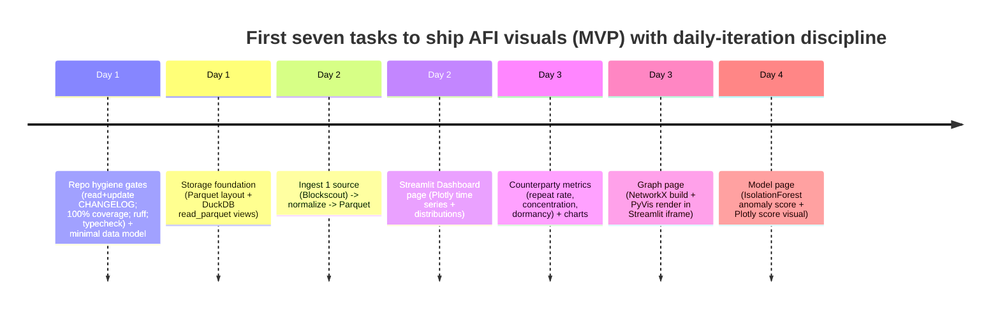

# AFI Visualization and Serving Stack for a DeFiLlama-Style Product

## Executive summary

For a hackathon-to-MVP implementation of Agent Flow Intelligence (AFI)—a behavior-first “Bloomberg Terminal for DeFi” focused on wallet/service/payment observability—the proposed stack (**Python + Pandas + Streamlit + Plotly + PyVis + NetworkX + scikit-learn**) is an excellent **fastest-shippable** path *if* you treat it as an MVP cockpit and plan an explicit migration route to a production frontend and backend APIs.

The strongest evidence-based fit is that Streamlit natively renders **interactive Plotly figures** (`st.plotly_chart`) and has built-in **caching primitives** (`st.cache_data`, `st.cache_resource`) that directly mitigate the “rerun on interaction” model and expensive upstream API pulls; plus it supports embedding arbitrary HTML in an iframe (`st.components.v1.html`), which is exactly what you need to embed PyVis’ HTML output quickly. citeturn0search0turn0search1turn2search2 Plotly itself is explicitly positioned as an interactive, browser-based graphing library with many chart types. citeturn3search0turn3search4 PyVis is explicitly built for “quick generation of visual network graphs with minimal python code,” which aligns with “graph page in one day.” citeturn0search3turn0search15 NetworkX provides the server-side graph model and analysis algorithms to compute relationship metrics. citeturn2search3 scikit-learn gives fast, standard anomaly/clustering baselines (e.g., IsolationForest, KMeans) for “risk/anomaly flags as a first model.” citeturn5search0turn5search1

For data serving/storage, the cleanest MVP choice is **Parquet as the durable “fact store”** (efficient columnar format) plus **DuckDB as the local analytics engine** (query Parquet directly via `read_parquet`, create views/tables, and aggregate quickly). citeturn1search1turn8search3 DuckDB’s concurrency model is well-defined (single writer process; multiple read-only processes; MVCC within a writer process), which matters once you deploy and have concurrent app users. citeturn6search3

If you want AFI to feel DeFiLlama-like, treat DeFiLlama as inspiration for: multiple “dimensions” dashboards, open endpoints/docs, and a clear, transparent data model. DeFiLlama publishes API documentation and an ecosystem of adapters, emphasizing transparency/open source; their docs enumerate multiple dashboard “dimensions” (DEX volume, fees, etc.), which is the same mental model AFI can adopt for agent commerce. citeturn4search0turn4search2turn4search5

---

## Recommendation verdict

The proposed stack is the best **fast MVP** approach for AFI visuals and serving **when your goal is to ship an interactive, exploratory cockpit quickly** and you accept that Streamlit is primarily an MVP UI layer—then you evolve toward a production-grade architecture (React + Plotly + Cytoscape.js, plus a FastAPI backend).

Verdict summary:
- Use **Streamlit + Plotly** for a working terminal-like dashboard quickly because Streamlit directly supports interactive Plotly embedding. citeturn0search0  
- Use **PyVis** for the first graph page because it outputs interactive HTML graphs in minimal code, and Streamlit can embed HTML via an iframe component. citeturn0search3turn2search2  
- Use **NetworkX** to build the relationship model and compute graph metrics server-side. citeturn2search3  
- Use **scikit-learn** for a first anomaly/clustering layer (IsolationForest / KMeans). citeturn5search0turn5search1  
- Store data in **Parquet + DuckDB** so you can scale beyond pure in-memory Pandas quickly while keeping “data-lake simplicity.” citeturn1search1turn8search3  

---

## Rationale and tradeoffs

### Speed and developer velocity

Streamlit is built for turning Python scripts into interactive apps quickly and supports deployment via Streamlit Community Cloud. citeturn3search19turn6search12 Its caching APIs (`st.cache_data` / `st.cache_resource`) are specifically designed to reduce repeated expensive computation and support shared resources (like DB connections or ML models) across reruns and sessions. citeturn0search1 This is extremely aligned with AFI because AFI pulls from multiple upstream APIs and repeatedly recomputes aggregates by wallet/service/time windows.

Plotly accelerates “terminal-like” interactivity: hover tooltips, zoom/pan, filtering patterns, and a broad catalog of chart types; Plotly’s Python library is explicitly an interactive graphing library built on plotly.js. citeturn3search0turn3search4

PyVis is optimized for quick delivery: its tutorial states it’s meant for quick generation of visual network graphs with minimal Python code, and it wraps a JS visualization library (vis.js). citeturn0search3 For MVP, that means your graph page can exist in days, not weeks.

### Interactivity and product feel

Streamlit + Plotly does deliver a “product feel” for dashboards. Meanwhile, Matplotlib is viable but Streamlit’s own `st.pyplot` documentation warns that Matplotlib doesn’t work well with threads and that the issue is more prominent with concurrent users in deployed apps. citeturn3search3 That warning doesn’t mean “never,” but it supports avoiding Matplotlib as your primary interactive layer for a multi-user hosted MVP.

For relationship graphs, PyVis is excellent for fast interactivity, but Cytoscape.js is structurally stronger for a production UX: its official docs describe a core graph instance as the main entry point and “collections” as sets of elements for graph manipulation, which powers richer event handling and UI controls. citeturn1search3turn1search7 This is why PyVis is an MVP renderer and Cytoscape.js is the production renderer.

### Scalability and performance

Pandas is fast enough for “MVP per-wallet slices,” but for a DeFiLlama-style product you’ll want “query-first” storage. Apache Parquet is a column-oriented format designed for efficient storage and retrieval with high-performance compression and encoding. citeturn1search1 DuckDB can query Parquet directly via `read_parquet` and you can create views/tables over Parquet for SQL queries. citeturn8search3

Concurrency becomes the limiting factor before raw compute: Streamlit’s rerun model, combined with multiple users, puts pressure on caches and shared resources. DuckDB’s concurrency docs outline two key modes: a single process can read/write, while multiple processes can read-only with `access_mode = 'READ_ONLY'`, and within a single writer process DuckDB uses MVCC + optimistic concurrency control. citeturn6search3 This strongly suggests an MVP architecture where ingestion writes happen in one process/job, while the app reads from read-only snapshots or read-only connections.

### Assumptions

Dataset size, user concurrency, and target refresh latency are unspecified; the recommendation assumes a hackathon/MVP scale where you are monitoring tens to hundreds (not millions) of wallets/services concurrently, and where “near real-time” is good but not mandatory for all data sources.

---

## Detailed architecture for an MVP terminal

### Data flow and storage model

A pragmatic AFI MVP data flow:

1. **Ingest** raw events from APIs (Blockscout/The Graph/Dune/Locus/x402 receipts, etc.).
2. **Normalize** into a small set of “core facts” (interaction, settlement, service endpoint, attestation/evidence).
3. **Persist** raw + normalized facts to Parquet (append-only partitions).
4. **Serve** by querying Parquet via DuckDB to produce wallet/service/time-window aggregates.
5. **Render** via Streamlit + Plotly + PyVis.

Why **Parquet + DuckDB** as the preferred base:
- Parquet is designed for efficient analytical storage and retrieval and is widely supported across tooling. citeturn1search1  
- DuckDB supports querying Parquet directly (`read_parquet`) and building views/tables over Parquet files, letting you keep storage “data-lake simple” while still doing fast SQL analytics. citeturn8search3  

### Storage layout recommendation

Prefer **Parquet as the durable store** and **DuckDB as the analytical/serving engine**:

- `data/raw/<source>/<YYYY>/<MM>/<DD>/*.parquet`
- `data/normalized/<entity>/<YYYY>/<MM>/<DD>/*.parquet`
- optional `data/duckdb/afi.duckdb` as a local “accelerator” (materialized views / derived tables)

For hackathon MVP, you can keep everything local on disk. Post-hackathon, the same structure lifts to S3/R2/GCS.

### DuckDB access patterns and concurrency

DuckDB allows:
- Creating a view over Parquet and querying it “as if it were a built-in table.” citeturn8search3  
- Multiple processes reading from the same DB file in read-only mode, and a single writer process for write operations. citeturn6search3  

Recommended MVP approach:
- Run ingestion as a scheduled job (single writer) that appends Parquet and optionally refreshes DuckDB-materialized aggregates.
- Run Streamlit as “mostly read-only”: it queries DuckDB in read-only mode or reads Parquet directly via DuckDB.

### Caching strategy and secrets

**Streamlit cache (MVP default):**
- Use `st.cache_data` for DataFrames and query results so repeated user interactions don’t re-fetch or re-aggregate. Streamlit notes `st.cache_data` returns a new copy per call and is safe against mutations/race conditions; `st.cache_resource` is for global resources like DB connections and ML models. citeturn0search1  
- Apply TTLs / max entries in cache for “freshness” and memory control (especially on Streamlit Community Cloud). citeturn0search1turn6search9  

**Redis (upgrade path):**
- Use Redis when you need shared caching across multiple Streamlit replicas or a separate API backend. Redis supports key expiration via `EXPIRE`, which is foundational for TTL-based caching. citeturn4search3  

**Secrets:**
- Keep API keys out of the repo and read them from Streamlit’s secrets management (`st.secrets`) and/or environment variables. citeturn2search0turn2search8  

### Concurrency and deployment options

**Streamlit Community Cloud (fastest demo):**
- Streamlit’s Cloud product is explicitly positioned for deploying, managing, and sharing apps; Streamlit docs cover how to deploy and share apps. citeturn6search12turn6search8turn6search0  
- Community Cloud has practical limitations (sleeping apps, resource limits) discussed by the Streamlit community; plan for caching and small datasets. citeturn6search1turn6search9  

**Docker deployment (recommended for serious demos):**
- Streamlit has a first-party Docker deployment tutorial, including exposing port 8501, health checks, and running via `streamlit run ... --server.address=0.0.0.0`. citeturn7view1  

**FastAPI backend + Streamlit frontend (for scalability):**
- Use FastAPI as a dedicated backend service (API + caching + webhook ingestion) and keep Streamlit as the UI. FastAPI docs discuss running server workers (multiple processes) and the difference between a single Uvicorn process and replicated processes. citeturn1search2  
- Uvicorn’s deployment guidance recommends `gunicorn -k uvicorn.workers.UvicornWorker` for production and separate local dev guidance. citeturn1search14  

---

## UI component mapping for AFI

Streamlit supports multi-page apps, and session state persists across pages for a user session. citeturn2search1 This maps cleanly to your “dashboard/graph/model” mental model.

### Suggested pages and chart mapping

**Dashboard page (behavior & flows)**
Use Plotly charts rendered via `st.plotly_chart`. citeturn0search0turn3search0  
Recommended per-metric views:

- Tx volume over time (line/area): supports FREQ, DORM, burstiness.
- Counterparty breadth and concentration (bar + cumulative share): CP, RCP, CONC, funding dependency.
- Payment size distribution (hist/box): APS, outlier flags.
- Settlement latency distribution (hist/box): SLAT; tie to rails.
- Fulfillment latency distribution (hist/box): FLAT (when you have service response timestamps or receipts).
- Reliability bands (small multiples by service/provider): DDL miss rate proxy, failure rates.

**Graph page (wallet ↔ service ↔ settlement)**
- Build graph with NetworkX for analytics and filtering (k-hop neighborhoods, top counterparties). NetworkX is designed for creation, manipulation, and study of networks and supports data structures and many standard algorithms. citeturn2search3  
- Render using PyVis as “fastest interactive graph view.” PyVis is meant for quick generation of network graphs with minimal code. citeturn0search3turn0search15  
- Embed PyVis HTML in Streamlit via `streamlit.components.v1.html` (HTML string rendered in an iframe). citeturn2search2  

**Model page (scores, clusters, anomalies)**
- Use scikit-learn baselines:
  - IsolationForest for anomaly flags; scikit-learn shows standard `.fit` and `.predict` patterns. citeturn5search0  
  - KMeans for clustering “behavior archetypes.” citeturn5search1  
- Visualize scores/clusters using Plotly scatter + tables.

### Small comparison table: Plotly vs Vega-Lite vs D3/Cytoscape

| Tool | Best for | Strengths | Tradeoffs |
|---|---|---|---|
| Plotly (Python) | Fast interactive charts in Python apps | Interactive, browser-based; many chart types; Streamlit supports it directly via `st.plotly_chart`. citeturn0search0turn3search4 | Can be heavier than minimal JS; not a graph renderer |
| Vega-Lite | Declarative interactive visuals | High-level grammar for interactive graphics; concise JSON specs. citeturn3search1turn3search13 | More “spec-first”; Python integration often via Altair; may add learning curve |
| D3.js + Cytoscape.js | Bespoke web UX + graphs | D3 is low-level and extremely flexible; Cytoscape focuses on interactive graph theory UI with core/collections. citeturn3search10turn1search3 | Higher frontend complexity; best for production React app |

---

## Positioning AFI as a DeFiLlama-like terminal

DeFiLlama’s public posture is “transparent, accurate, open source,” and they operate through a rich ecosystem of community-maintained adapters. citeturn4search2turn4search12 Their docs describe that dashboards focus on distinct “dimensions” (DEX volume, fees, aggregators, bridges, options, etc.), which is a strong product pattern to emulate for AFI: **multiple dimension pages powered by a unified data model.** citeturn4search5

### AFI “dimensions” mapping

Adopt a DeFiLlama-like information architecture:

- **Flows**: payments and settlements (by chain/rail/service/provider)
- **Counterparties**: wallet-to-wallet/service networks, concentration risk
- **Reliability**: settlement success, fulfillment latency bands
- **Protocols**: label interactions by protocol (via The Graph/Dune)
- **Evidence**: receipts/attestations density per entity

### Data model and open API approach

DeFiLlama publishes API docs and distinguishes free vs locked endpoints, with base URLs like `https://pro-api.llama.fi` noted in the docs site. citeturn4search0 This “public docs + clear base URLs” is a strong pattern: AFI should publish:
- a simple OpenAPI spec for AFI’s own endpoints (wallet profile, counterparty profile, graph neighborhood, time series aggregates)
- public documentation describing signals, confidence, and what is *not* asserted (no identity verification by default)

### Subgraphs/queries as “semantic labeling” layer

To feel DeFiLlama-like (protocol-aware, not just tx-aware), AFI should rely on:
- **The Graph**: Subgraphs provide indexed, queryable protocol events and models; The Graph docs state subgraphs receive **100,000 free queries/month**. citeturn8search1turn8search4  
- **Dune**: for SQL-defined dimensions quickly (protocol-specific metrics, escrow completion, staking/slashing, etc.), using its Data API. citeturn4search0turn5search0  

### Example ingestion request to support “public docs with reproducible queries”

**Blockscout PRO (wallet tx source)**
```bash
curl "https://api.blockscout.com/8453/api/v2/blocks/12345678?apikey=proapi_YOUR_KEY"
```
Blockscout’s PRO API documentation provides a free plan with 100K credits/day and 5 req/sec, and is meant for high-usage projects. citeturn8search2turn8search10  

**The Graph (protocol labeling)**
```bash
curl -X POST \
  -H "Content-Type: application/json" \
  -d '{"query":"{ __schema { queryType { name } } }"}' \
  "https://gateway.thegraph.com/api/YOUR_API_KEY/subgraphs/id/YOUR_SUBGRAPH_ID"
```
The Graph docs describe how to query subgraphs from applications using GraphQL endpoints. citeturn8search4turn8search12  

### Branding / UX notes for a “Bloomberg Terminal” vibe (without overbuilding)

- Prioritize “keyboard-first” interactions: wallet search box + fast filters.
- Use compact, information-dense panels and consistent terminology (Flows, Counterparties, Reliability, Evidence).
- Treat every chart as drill-downable to an “evidence packet.”

---

## Migration path to a production-grade terminal

### Frontend

Move from Streamlit pages to:
- **React** for a real SPA terminal experience
- **Plotly.js** (or Plotly React components) for charts
- **Cytoscape.js** for graph interaction (filters, selection, neighborhoods, layouts)

Cytoscape.js’ docs explicitly define an architecture with a core graph instance and collections, supporting layouts and viewport operations. citeturn1search3turn1search7

### Backend

As soon as you have:
- multiple concurrent users,
- webhook ingestion (Moralis/Alchemy or similar),
- or heavy caching needs,

split the system into:
- **FastAPI** backend (ingestion, normalization, cache, APIs)
- **Streamlit** becomes optional (prototype UI), while React becomes the primary UI

FastAPI’s deployment docs discuss scaling via replication (multiple worker processes) vs single-process Uvicorn. citeturn1search2 Uvicorn’s deployment guidance recommends using Gunicorn with Uvicorn workers for production. citeturn1search14

### Serving and “real-time” updates

- For sources that support webhooks/push (Alchemy Notify, Moralis Streams, Stripe webhooks, etc.), use webhooks to compute near-real-time updates.
- For query APIs (Blockscout, The Graph, Dune, DeFiLlama APIs), use polling with caching and incremental backfills.

Streamlit’s caching is excellent for MVP, but for production you generally want Redis as a shared cache; Redis supports TTL/expiry with commands like `EXPIRE`. citeturn0search1turn4search3

---

## Implementation checklist and starter kit

### First seven tasks with time estimates



**Task notes and “daily-iteration protocol” (explicitly required):**

- **Repo hygiene gates** (3–6 hours):  
  - Always begin by reading `CHANGELOG.md`, then end by updating it (Keep a Changelog recommends curated, human-readable change entries). citeturn9search7  
  - Enforce 100% coverage including branch coverage: coverage.py supports branch coverage measurement, and pytest-cov can configure branch coverage via `--cov-branch` and config integration. citeturn5search14turn5search3  
  - Add lint/typecheck gates (2–3 hours):
    - Ruff is explicitly designed as an extremely fast Python linter and drop-in replacement for Flake8 plus many plugins. citeturn9search0  
    - Mypy is an optional static type checker for Python (useful once you have stable data models). citeturn9search1  

- **Storage foundation** (2–4 hours): implement a Parquet partition scheme; add DuckDB views over Parquet using `read_parquet`. DuckDB explicitly documents creating views over Parquet and querying them. citeturn8search3turn1search1  

- **Ingest one source** (4–8 hours): choose Blockscout PRO first (clear free plan, high value). Blockscout PRO free plan includes 100K credits/day with 5 req/sec. citeturn8search2turn8search10  

- **Dashboard page** (4–6 hours): implement Plotly charts and render via `st.plotly_chart`. citeturn0search0turn3search0  

- **Counterparty metrics** (4–6 hours): compute CP, RCP, CONC, DORM. Cache results via `st.cache_data`. citeturn0search1  

- **Graph page** (4–8 hours): build graph with NetworkX; render with PyVis and embed via `st.components.v1.html`. citeturn2search3turn0search3turn2search2  

- **Model page** (4–6 hours): start with IsolationForest anomaly flags and plot output. scikit-learn documents IsolationForest usage and `.predict` output. citeturn5search0  

### Recommended folder structure

```text
afi/
  app/
    Home.py
    pages/
      Dashboard.py
      Graph.py
      Models.py
      Evidence.py
  afi_core/
    __init__.py
    config.py
    models/
      entities.py          # Pydantic/dataclasses: Wallet, Interaction, Settlement, Service, Attestation
      schemas.py
    ingest/
      blockscout.py
      thegraph.py
      dune.py
    transform/
      normalize.py
      metrics.py
      features.py
    graph/
      build_graph.py
      render_pyvis.py
    ml/
      anomaly.py
      cluster.py
    storage/
      parquet.py
      duckdb.py
  data/
    raw/
    normalized/
    duckdb/
  tests/
    test_ingest_blockscout.py
    test_metrics.py
    test_graph.py
    test_models.py
  .streamlit/
    config.toml
    secrets.toml.example
  CHANGELOG.md
  pyproject.toml
  README.md
```

Key architectural choices:
- Treat `afi_core/` as the “library” and `app/` as the frontend. This makes migrating to FastAPI + React much easier later.
- Put ingestion “adapters” in `afi_core/ingest/` and keep them pure + testable.

### 50-line MVP starter: Streamlit + Plotly + PyVis

This snippet demonstrates the minimal “terminal skeleton”: one Plotly chart and one PyVis graph embedded in Streamlit.

```python
import pandas as pd
import streamlit as st
import plotly.express as px
from pyvis.network import Network
import streamlit.components.v1 as components

st.set_page_config(page_title="AFI MVP", layout="wide")
st.title("Agent Flow Intelligence — MVP")

@st.cache_data(ttl=300)
def load_demo_data() -> pd.DataFrame:
    return pd.DataFrame(
        {"ts": pd.date_range("2026-03-01", periods=30, freq="D"),
         "tx_count": [abs(int(50 + 20*i%7 - 10*(i%5==0))) for i in range(30)]}
    )

df = load_demo_data()
fig = px.line(df, x="ts", y="tx_count", title="Tx Volume (demo)")
st.plotly_chart(fig, use_container_width=True)

st.subheader("Flow Graph (demo)")
net = Network(height="500px", width="100%", directed=True)
net.add_node("wallet:0xabc", label="wallet:0xabc", group="wallet")
net.add_node("service:x402", label="service:x402", group="service")
net.add_node("settlement:0xdef", label="settlement:0xdef", group="settlement")
net.add_edge("wallet:0xabc", "service:x402", label="paid call")
net.add_edge("service:x402", "settlement:0xdef", label="tx")

html = net.generate_html()
components.html(html, height=520, scrolling=True)
```

Why this works:
- Plotly interactivity is surfaced through Streamlit’s `st.plotly_chart`. citeturn0search0  
- PyVis produces HTML that you can embed via Streamlit’s HTML iframe component. citeturn0search3turn2search2  
- `st.cache_data` avoids rerunning expensive loads on every UI interaction. citeturn0search1  

---

## Risks and mitigations

### Concurrency and Streamlit reruns

Risk: Streamlit reruns top-to-bottom on each interaction; without caching, you can thrash upstream APIs and degrade performance. Mitigation: aggressive `st.cache_data` for API calls and precomputed aggregates; `st.cache_resource` for DB connections and ML models. citeturn0search1

Risk: Matplotlib thread issues under concurrent usage are explicitly flagged by Streamlit (`st.pyplot` warns Matplotlib doesn’t work well with threads). Mitigation: prefer Plotly for interactive visuals; if Matplotlib is used, isolate with locks—per Streamlit docs. citeturn3search3

### Rate limits and upstream API costs

Risk: polling too frequently will blow free-tier limits and degrade reliability. Mitigation: prefer cache+backfill; use webhook-capable sources when available; treat on-demand queries as the default for UI.

- The Graph: 100,000 free queries/month; cache and batch queries. citeturn8search1  
- Blockscout PRO: free plan 100K credits/day, 5 req/sec; use incremental range queries + caching. citeturn8search2turn8search10  

### Data integrity and “single writer” patterns

Risk: corruption or inconsistencies if multiple processes write to the same DuckDB/Parquet partition. Mitigation: run ingestion as a single writer process; app reads read-only views. DuckDB’s concurrency docs describe a single writer process model and read-only multi-process support. citeturn6search3

### Privacy and secrets management

Risk: leaking API keys or storing PII-adjacent data. Mitigation: use Streamlit secrets management and environment variables; avoid committing secrets. citeturn2search0turn2search8

### Product positioning risk

Risk: “Bloomberg Terminal for DeFi” can become too broad. Mitigation: follow DeFiLlama’s “dimension dashboards” pattern—ship a small number of crisp dimensions first, and keep the rest as roadmap. citeturn4search5